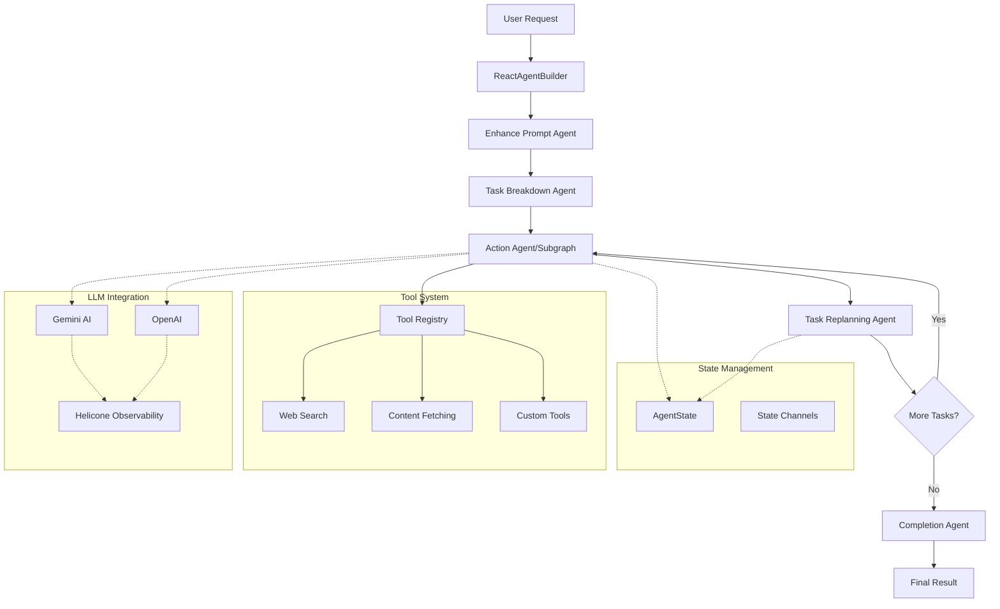

# DelReact Agent Framework Documentation

[](https://www.npmjs.com/package/delreact-agent)
<!-- [](https://github.com/Delegasi-Tech/DelReact/commits/main) -->
<!-- [](https://www.npmjs.com/package/delreact-agent) -->
[](https://github.com/Delegasi-Tech/DelReact/actions/workflows/publish.yml)
[](https://github.com/Delegasi-Tech/DelReact/issues)

## Overview

DelReact Agent is a powerful agent-based task-execution planning framework built on LangChain LangGraph, designed for reliable multi-step AI task automation with dynamic replanning capabilities.

## Quick Start

### Installation & Setup

```bash
npm i delreact-agent
```

Set up environment variables:
```bash
# .env
GEMINI_KEY=your_gemini_api_key
OPENAI_KEY=your_openai_api_key  # Optional
```

### Basic Usage

```typescript
import { ReactAgentBuilder } from "delreact-agent";

const agent = new ReactAgentBuilder({
  geminiKey: process.env.GEMINI_KEY,
  openaiKey: process.env.OPENAI_KEY
})
.init({
  selectedProvider: 'gemini',
  model: 'gemini-2.5-flash'
})
.build();

const result = await agent.invoke({
  objective: "Plan a marketing campaign for a new product launch",
  outputInstruction: "Structured plan with timeline and budget"
});

console.log(result.conclusion);
```

## 🚀 **Status & Testing**

### ✅ **Production Ready Features**
- **ReactAgentBuilder**: Full multi-provider LLM support ✅
- **SubgraphBuilder**: Context-safe execution with method chaining ✅  
- **BaseAgent Pattern**: Extensible agent architecture ✅
- **Action Node Replacement**: Drop-in subgraph integration ✅
- **Error Handling**: Comprehensive fallback strategies ✅

### 🧪 **Recently Tested**
```bash
# Successful test case (2025-08-07)
✅ ReactAgentBuilder: Graph built successfully
✅ Enhanced prompt processing enabled
✅ Multi-step workflow execution
✅ Tool integration with registry system
✅ State compatibility between agents and subgraphs
```

**Test Objective**: "Use web search to analyze market trends and create content strategy for Jeans Denim targeting young adults"  
**Result**: Full pipeline execution with tool integration and dynamic replanning ✅

## Core Components

### 1. ReactAgentBuilder
The main orchestration class that manages the agent workflow.

**Key Features:**
- Multi-provider LLM support (Gemini, OpenAI)
- Session management and tracking
- Built-in error handling and recovery
- Dynamic task replanning
- **Action node replacement with custom agents/subgraphs** ✅

### 2. SubgraphBuilder (TBA)
**Eliminates 90% of custom workflow boilerplate code** with intuitive method chaining.

**Quick Example:**
```typescript
import { SubgraphBuilder } from "delreact-agent";

const ActionSubgraph = new SubgraphBuilder()
  .addAgent("research", ResearchAgent)
  .addAgent("analysis", AnalysisAgent)
  .addAgent("synthesis", SynthesisAgent)
  .addFlow("research", "analysis")
  .addFlow("analysis", "synthesis")
  .setErrorStrategy("fallback")
  .build();

// Drop-in replacement for ActionAgent
const agent = new ReactAgentBuilder(config)
  .replaceActionNode(ActionSubgraph);  // ✅ Tested & Working
```

**Features:**
- **Context-Safe Execution**: Automatic binding prevents callback errors ✅
- **Conditional Routing**: Support for conditional flows and routing logic
- **Error Strategies**: Configurable fallback, fail-fast, and retry options  
- **State Compatibility**: Seamless integration with existing AgentState
- **Tool Integration**: Automatic tool injection based on agent configuration

[📖 Complete SubgraphBuilder Guide](./docs/SubgraphBuilder-Guide.md)
[🔧 SubgraphBuilder Quick Reference](./docs/SubgraphBuilder-Quick-Reference.md)

### 3. Tool System
Registry-based tool management with dynamic availability and **MCP integration**.

**Key Features:**
- Dynamic tool registration and availability
- Config-aware tool injection
- Structured schema validation with Zod
- Built-in tools: web search, content fetching, prompt enhancement
- **MCP (Model Context Protocol) support for external tool servers**

[📖 Complete Tool System Guide](./docs/Tool-System-Guide.md)
[🔧 Tool System Quick Reference](./docs/Tool-System-Quick-Reference.md)
[📖 MCP Integration Guide](./docs/MCP-Integration-Guide.md)
[🔧 MCP Quick Reference](./docs/MCP-Integration-Quick-Reference.md)

### 4. Core Agent Pipeline

The framework uses a 5-stage workflow:

1. **Enhance Prompt** (optional) - Improves user prompts for clarity and precision
2. **Task Breakdown** - Decomposes objectives into executable tasks
3. **Action Execution** - Processes individual tasks with available tools
4. **Task Replanning** - Dynamically adjusts remaining tasks based on progress
5. **Completion** - Synthesizes results into final output

## Architecture



## Key Features

### ✅ **Multi-LLM Support**
- Google Gemini AI and OpenAI integration
- Automatic provider selection and fallback
- Unified interface for different LLM providers

### ✅ **Dynamic Task Planning**
- Automatic task breakdown from high-level objectives
- Real-time replanning based on execution results
- Adaptive workflow that adjusts to changing requirements

### ✅ **State Management**
- Type-safe state channels with reducers
- Immutable state updates
- Complete execution context preservation

### ✅ **Observability**
- Built-in Helicone integration for monitoring
- Session tracking and request correlation
- Comprehensive logging throughout execution

### ✅ **Tool Integration**
- Registry-based tool management with dynamic availability
- Built-in web search capabilities (Brave API)
- Content fetching and markdown conversion
- Custom business tool support
- **MCP (Model Context Protocol) support** for external tool servers
- Automatic tool injection based on agent configuration

### ✅ **Memory Support**
- Multiple backend support: in-memory, PostgreSQL, Redis
- Session-based memory management
- Context-aware memory retrieval
- Automatic memory initialization

## Use Cases

### 1. **Content Creation**
```typescript
const result = await agent.invoke({
  objective: "Create a comprehensive blog post about sustainable living practices",
  outputInstruction: "SEO-optimized blog post with 1500+ words, subheadings, and actionable tips"
});
```

### 2. **Business Analysis**
```typescript
const result = await agent.invoke({
  objective: "Analyze competitor pricing strategies in the SaaS market",
  outputInstruction: "Executive summary with data tables, insights, and strategic recommendations"
});
```

### 3. **Technical Documentation**
```typescript
const result = await agent.invoke({
  objective: "Create API documentation for a REST service with authentication",
  outputInstruction: "Complete API docs in Markdown with code examples and response schemas"
});
```

### 4. **Research & Data Analysis**
```typescript
const result = await agent.invoke({
  objective: "Research renewable energy trends and their economic impact",
  outputInstruction: "Research report with citations, data analysis, and future projections"
});
```

### Custom Tool Integration

Add custom tools to enhance agent capabilities:

```typescript
const customTool = createAgentTool({
  name: "custom-calculator",
  description: "Perform custom calculations",
  schema: {
    operation: { type: "string", description: "Type of calculation" },
    values: { type: "array", description: "Input values" }
  },
  async run({ operation, values }) {
    // Tool implementation
    return { result: "calculation result" };
  }
});

const agent = new ReactAgentBuilder({
  geminiKey: process.env.GEMINI_KEY
})
.addTool([customTool])
.build();
```

## Configuration

### Environment Variables
```bash
# Required: At least one LLM provider key
GEMINI_KEY=your_gemini_api_key
OPENAI_KEY=your_openai_api_key

# Optional: Helicone configuration
HELICONE_KEY=your_helicone_key
```

### ReactAgentBuilder Configuration
```typescript
const agent = new ReactAgentBuilder({
  geminiKey: process.env.GEMINI_KEY,
  openaiKey: process.env.OPENAI_KEY,
  useEnhancedPrompt: true,  // Enable prompt enhancement
  memory: "in-memory",      // or "postgres", "redis"
  braveApiKey: process.env.BRAVE_API_KEY,  // For web search
  enableToolSummary: true   // LLM summary of tool results
})
.init({
  selectedProvider: "gemini",  // or "openai"
  model: "gemini-2.5-flash"
})
.build();

// Runtime configuration updates
agent.updateConfig({
  selectedProvider: "openai",
  enableToolSummary: false
});
```

## Monitoring & Observability

### Built-in Session Tracking
Every execution generates a unique session ID for tracking:

```typescript
const result = await agent.invoke({
  objective: "Task to track",
  sessionId: "custom-session-id"  // Optional
});

console.log("Session ID:", result.sessionId);
```

### Helicone Integration
Automatic integration with Helicone for:
- Request/response logging
- Session correlation
- Performance monitoring
- Cost tracking

## Contributing

### Development Setup
1. Clone the repository
2. Install dependencies: `npm install`
3. Set up environment variables
4. Start demo: `npm run demo`

## Roadmap

### Phase 1: ✅ Core Framework (Complete)
- ReactAgentBuilder with multi-provider LLM support
- BaseAgent pattern for extensible agents
- Tool registry system with dynamic availability
- Memory support (in-memory, PostgreSQL, Redis)
- Enhanced prompt processing

### Phase 2: ✅ Advanced Workflow (In Progress)
- CreateWorkflow for complex agent workflows
- Node Agent replacement capability
- Multi-step Agent Workflows
- Seamless integration with existing architecture

### Phase 3: 📋 Enhanced Tool Ecosystem (In Progress)
- Advanced basic business tools: Image Generation
- Knowledge/Embedding Injection
- ✅ **MCP Tool composition** - Support for Model Context Protocol servers
- ✅ **Dynamic tool discovery and registration** - Automatic MCP tool integration


## License & Commercial Use

This project is licensed under the Apache License, Version 2.0. See the LICENSE file for details.

**Commercial use of this software (including use in proprietary products, SaaS, or as part of a paid service) requires explicit written permission from the author/company.**

Attribution in product documentation and source code is required for all uses. For commercial licensing, please contact Delegasi-Tech (or the repository owner).

## Support

### Documentation
- [ReactAgentBuilder Guide](./docs/ReactAgentBuilder-Guide.md) - Complete usage guide
- [ReactAgentBuilder Quick Reference](./docs/ReactAgentBuilder-Quick-Reference.md) - Quick start examples
- [Tool System Guide](./docs/Tool-System-Guide.md) - Custom tool development
- [Tool System Quick Reference](./docs/Tool-System-Quick-Reference.md) - Tool creation examples
- [RAG Integration Guide](./docs/RAG-Integration-Guide.md) - Full RAG setup and performance tuning
- [RAG Integration Quick Reference](./docs/RAG-Integration-Quick-Reference.md) - Minimal steps and snippets

---

**DelReact Framework** - Reliable multi-step AI task automation with dynamic replanning capabilities.
