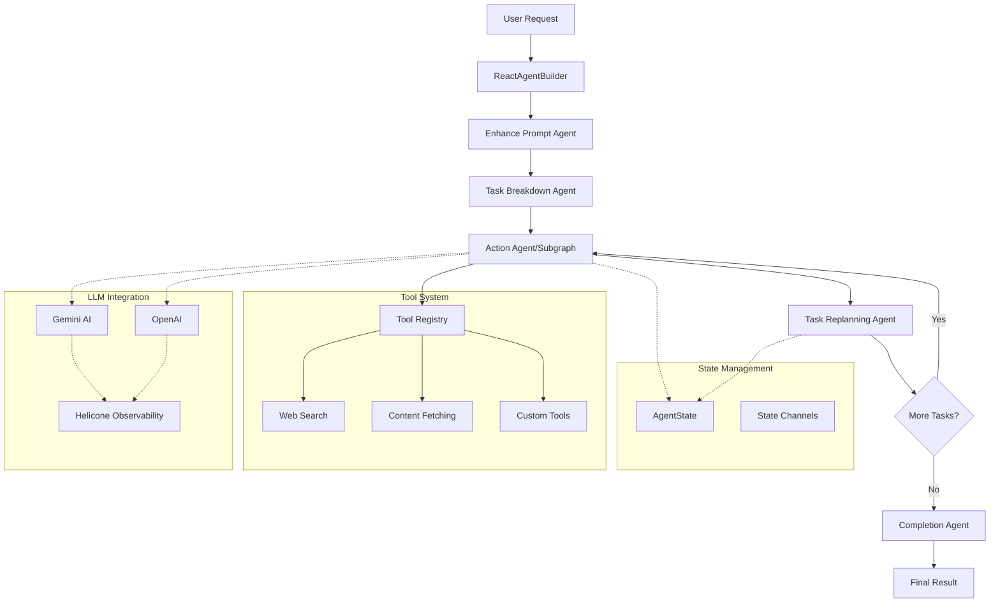

# DelReact Agent Framework Documentation

[](https://www.npmjs.com/package/delreact-agent)
<!-- [](https://github.com/Delegasi-Tech/DelReact/commits/main) -->
<!-- [](https://www.npmjs.com/package/delreact-agent) -->
[](https://github.com/Delegasi-Tech/DelReact/actions/workflows/publish.yml)
[](https://github.com/Delegasi-Tech/DelReact/issues)

## Overview

DelReact Agent is a robust, extensible framework for building intelligent AI agents that can autonomously plan, reason, and act to accomplish complex, multi-step tasks. 

> **tldr;**
> DelReact is like a super-smart libraries for your code/product extension. It can think, plan, and use tools to finish big jobs all by itself. You just tell it what you want, and it figures out the steps, finds answers, and gets things done—kind of like a person who can read, search, and solve problems for you. It learns and adapts as it works, so you don’t have to do everything by hand.

See [What is AI Agent](./docs/WHAT-IS-AI-AGENT.md) for complete overview

## Quick Start

### Installation & Setup

```bash
npm i delreact-agent
```

Set up environment variables:
```bash
# .env
GEMINI_KEY=your_gemini_api_key
OPENAI_KEY=your_openai_api_key  # Optional
```

### Basic Usage

```typescript
import { ReactAgentBuilder } from "delreact-agent";

const agent = new ReactAgentBuilder({
  geminiKey: process.env.GEMINI_KEY,
  openaiKey: process.env.OPENAI_KEY  // Optional
})
.init({
  selectedProvider: 'gemini',
  model: 'gemini-2.5-flash'
})
.build();

const result = await agent.invoke({
  objective: "Plan a marketing campaign for a new product launch",
  outputInstruction: "Structured plan with timeline and budget"
});

console.log(result.conclusion);
```

### Example Use Cases

**Content Creation**
```typescript
const result = await agent.invoke({
  objective: "Create a comprehensive blog post about sustainable living practices",
  outputInstruction: "SEO-optimized blog post with 1500+ words, subheadings, and actionable tips"
});
```

**Business Analysis**
```typescript
const result = await agent.invoke({
  objective: "Analyze competitor pricing strategies in the SaaS market",
  outputInstruction: "Executive summary with data tables, insights, and strategic recommendations"
});
```

**Technical Documentation**
```typescript
const result = await agent.invoke({
  objective: "Create API documentation for a REST service with authentication",
  outputInstruction: "Complete API docs in Markdown with code examples and response schemas"
});
```

**Research & Data Analysis**
```typescript
const result = await agent.invoke({
  objective: "Research renewable energy trends and their economic impact",
  outputInstruction: "Research report with citations, data analysis, and future projections"
});
```

## DelReact Agent Core Components

### 1. ReactAgentBuilder
The main orchestration class that manages the agent workflow.

**Key Features:**
- Multi-provider LLM support (Gemini, OpenAI)
- Session management and tracking
- Built-in error handling and recovery
- Dynamic task replanning

### 2. Tool System
Registry-based tool management with dynamic availability and **MCP integration**.

**Key Features:**
- Dynamic tool registration and availability
- Config-aware tool injection
- Structured schema validation with Zod
- Built-in tools: web search, content fetching, prompt enhancement
- **MCP (Model Context Protocol) support for external tool servers**

Add custom tools to enhance agent capabilities:

```typescript
const customTool = createAgentTool({
  name: "custom-calculator",
  description: "Perform custom calculations",
  schema: {
    operation: { type: "string", description: "Type of calculation" },
    values: { type: "array", description: "Input values" }
  },
  async run({ operation, values }) {
    // Tool implementation
    return { result: "calculation result" };
  }
});

const agent = new ReactAgentBuilder({
  geminiKey: process.env.GEMINI_KEY
})
.addTool([customTool])
.build();
```

[📖 Complete Tool System Guide](./docs/Tool-System-Guide.md)
[🔧 Tool System Quick Reference](./docs/Tool-System-Quick-Reference.md)
[📖 MCP Integration Guide](./docs/MCP-Integration-Guide.md)
[🔧 MCP Quick Reference](./docs/MCP-Integration-Quick-Reference.md)

### 3. Core Agent Pipeline

The framework uses a 5-stage workflow:

1. **Enhance Prompt** (optional) - Improves user prompts for clarity and precision
2. **Task Breakdown** - Decomposes objectives into executable tasks
3. **Action Execution** - Processes individual tasks with available tools
4. **Task Replanning** - Dynamically adjusts remaining tasks based on progress
5. **Completion** - Synthesizes results into final output



### 4. Custom Workflow Agent

[TBA]

## Configuration

### Environment Variables
```bash
# Required: At least one LLM provider key
GEMINI_KEY=your_gemini_api_key
OPENAI_KEY=your_openai_api_key

# Optional: Helicone configuration
HELICONE_KEY=your_helicone_key
```

### ReactAgentBuilder Configuration
```typescript
const agent = new ReactAgentBuilder({
  geminiKey: process.env.GEMINI_KEY,
  openaiKey: process.env.OPENAI_KEY, // required at least one LLM provider key
  useEnhancedPrompt: true,  // Enable prompt enhancement
  memory: "in-memory",      // or "postgres", "redis"
  braveApiKey: process.env.BRAVE_API_KEY,  // For web search
  enableToolSummary: true   // LLM summary of tool results
})
.init({
  selectedProvider: "gemini",  // or "openai"
  model: "gemini-2.5-flash"
})
.build();

// Runtime configuration updates
agent.updateConfig({
  selectedProvider: "openai",
  enableToolSummary: false
});
```

## Monitoring & Observability

### Built-in Session Tracking
Every execution generates a unique session ID for tracking:

```typescript
const result = await agent.invoke({
  objective: "Task to track",
  sessionId: "custom-session-id"  // Optional
});

console.log("Session ID:", result.sessionId);
```

### Helicone Integration
Automatic integration with Helicone for:
- Request/response logging
- Session correlation
- Performance monitoring
- Cost tracking

## Contributing

### Development Setup
1. Clone the repository
2. Install dependencies: `npm install`
3. Set up environment variables
4. Start demo: `npm run demo`

See [Contributing Guide](./CONTRIBUTING.md) for further information

## Roadmap

### Phase 1: ✅ Core Framework (Complete)
- ReactAgentBuilder with multi-provider LLM support
- BaseAgent pattern for extensible agents
- Tool registry system with dynamic availability
- Memory support (in-memory, PostgreSQL, Redis)
- Enhanced prompt processing

### Phase 2: ✅ Advanced Workflow (In Progress)
- CreateWorkflow for complex agent workflows
- Node Agent replacement capability
- Multi-step Agent Workflows
- Seamless integration with existing architecture

### Phase 3: 📋 Enhanced Tool Ecosystem (In Progress)
- Advanced basic business tools: Image Generation
- ✅ Knowledge/Embedding Injection
- ✅ **MCP Tool composition** - Support for Model Context Protocol servers
- ✅ **Dynamic tool discovery and registration** - Automatic MCP tool integration

## License & Commercial Use

This project is licensed under the Apache License, Version 2.0. See the [LICENSE](./LICENSE) file for details.

**Commercial use of this software (including use in proprietary products, SaaS, or as part of a paid service) requires explicit written permission from the author/company.**

Attribution in product documentation and source code is required for all uses. For commercial licensing, please contact Delegasi-Tech (or the repository owner).

## Support

### Documentation
- [ReactAgentBuilder Guide](./docs/ReactAgentBuilder-Guide.md) - Complete usage guide
- [ReactAgentBuilder Quick Reference](./docs/ReactAgentBuilder-Quick-Reference.md) - Quick start examples
- [Tool System Guide](./docs/Tool-System-Guide.md) - Custom tool development
- [Tool System Quick Reference](./docs/Tool-System-Quick-Reference.md) - Tool creation examples
- [RAG Integration Guide](./docs/RAG-Integration-Guide.md) - Full RAG setup and performance tuning
- [RAG Integration Quick Reference](./docs/RAG-Integration-Quick-Reference.md) - Minimal steps and snippets

---

For further disclaimer see [NOTICE](./NOTICE)