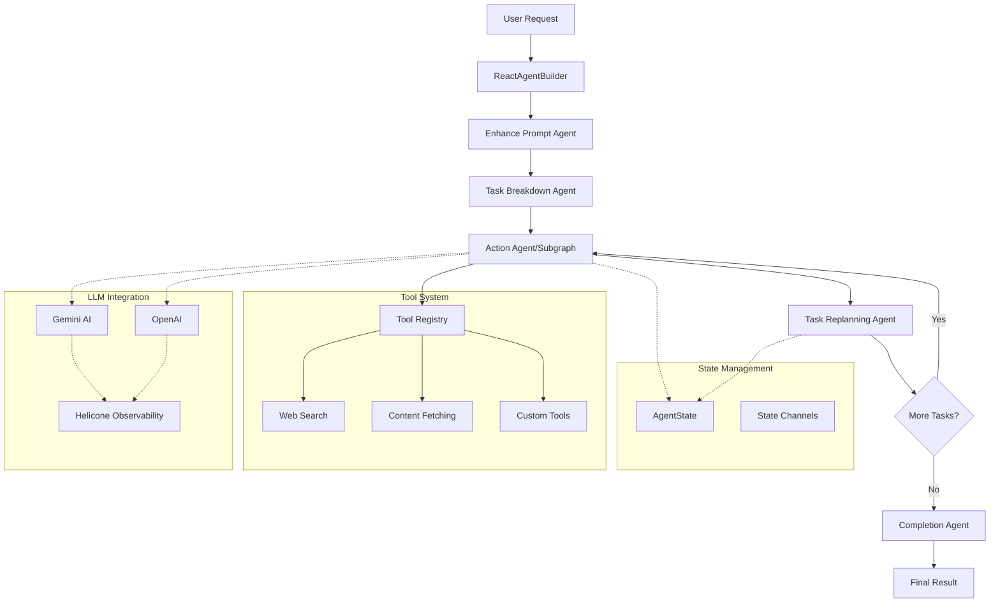

# DelReact Agent Framework Documentation

[](https://www.npmjs.com/package/delreact-agent)
<!-- [](https://github.com/Delegasi-Tech/DelReact/commits/main) -->
<!-- [](https://www.npmjs.com/package/delreact-agent) -->
[](https://github.com/Delegasi-Tech/DelReact/actions/workflows/publish.yml)
[](https://github.com/Delegasi-Tech/DelReact/issues)

## Overview

DelReact Agent is an extensible TS/JS framework for building intelligent AI agents that can autonomously plan, reason, and act to accomplish complex, multi-step tasks. 

> **tl;dr:**
> DelReact is like a super-smart libraries for your code/product extension. It can think, plan, and use tools to finish big jobs all by itself. You just tell it what you want, and it figures out the steps, finds answers, and gets things done—kind of like a person who can read, search, and solve problems for you. It learns and adapts as it works, so you don’t have to do everything by hand.

See [What is AI Agent](https://delegasi-tech.github.io/delreact-agent/WHAT-IS-AI-AGENT/#what-is-react-agent) for complete concept overview

## Quick Start

### Installation & Setup

```bash
# minimum nodejs version >= 18.0.0
# other minimum environment: npm >= 8.0.0, Typescript >= 4.7 (for TS projects), internet connection for LLM/tool APIs
npm i delreact-agent
# npm i dotenv
```

Set up environment variables:
```bash
# .env
GEMINI_KEY=your_gemini_api_key  # Pick One or Both
OPENAI_KEY=your_openai_api_key  # Pick One or Both
```

### Basic Usage

```typescript
import dotenv from "dotenv";
import { ReactAgentBuilder } from "delreact-agent";

dotenv.config();

const agent = new ReactAgentBuilder({
  openaiKey: process.env.OPENAI_KEY,  // example using openai
  useEnhancedPrompt: true
})
.init({
  selectedProvider: 'openai',
  model: 'gpt-4o-mini',
  maxTasks: 8,
})
.build();

const result = await agent.invoke({
  objective: "What is GDP of second winner on 2022 World Cup?",
  outputInstruction: "Present it in structured sections: Summary, GDP, Year, Country"
});

console.log(result.conclusion);
// Summary: The question asks for the GDP of the runner-up in the 2022 FIFA World Cup.\n\nGDP: $2.924 trillion\n\nYear: 2022\n\nCountry: France\n
```
- [ReactAgentBuilder Reference](https://delegasi-tech.github.io/delreact-agent/ReactAgentBuilder-Quick-Reference) - Quick start examples

### Example Use Cases

**Content Creation**
```typescript
const result = await agent.invoke({
  objective: "Create hooks and captions for Instagram Post about Indonesia Corruption this past month. Focusing on big cases.",
  outputInstruction: "1-2 paragraphs caption, with emotional hooks in markdown format Bahasa Indonesia. Just content without any discussions"
});
```

**Business Analysis API**
```typescript
const result = await agent.invoke({
  objective: "Analyze competitor pricing strategies in the Accounting SaaS market in Indonesia recently",
  outputInstruction: "A JSON format object with properties: summary, insights, recommendations"
});
```

**Finance Analysis Report**
```typescript
const result = await agent.invoke({
  objective: "Research and analyze CDIA Stock News Indonesia?",
  outputInstruction: "Present it in structured sections: Summary, Key Insights, Industry Insight, Market Impact, Future Outlook"
});
```

## DelReact Agent Core Components

### 1. ReactAgentBuilder
The main orchestration class that manages the agent workflow.

**Key Features:**
- Multi-provider LLM support (Gemini, OpenAI, Openrouter)
- Session management and tracking
- Built-in error handling and recovery
- Dynamic task replanning
- Custom agent prompts for specialized behavior

### 2. Tool System
Registry-based tool management with dynamic availability and **MCP integration**.

**Key Features:**
- Dynamic tool registration and availability
- Config-aware tool injection
- Structured schema validation with Zod
- Built-in tools: web search, content fetching, prompt enhancement
- **MCP (Model Context Protocol) support for external tool servers**

Add custom tools to enhance agent capabilities:

```typescript
const customTool = createAgentTool({
  name: "custom-calculator",
  description: "Perform custom calculations",
  schema: {
    operation: { type: "string", description: "Type of calculation" },
    values: { type: "array", description: "Input values" }
  },
  async run({ operation, values }) {
    // Tool implementation
    return { result: "calculation result" };
  }
});

const agent = new ReactAgentBuilder({
  geminiKey: process.env.GEMINI_KEY,
  ...
})
.addTool([customTool])
.init(...)
.build();
```

[🔧 Tool System Reference](https://delegasi-tech.github.io/delreact-agent/Tool-System-Quick-Reference)
[🔧 MCP Reference](https://delegasi-tech.github.io/delreact-agent/MCP-Integration-Quick-Reference)

### 3. Custom Agent Prompts

Customize agent behavior for specific domains, industries, or use cases by providing custom prompts for each agent type.

**Key Features:**
- Domain-specific agent specialization (healthcare, finance, education, etc.)
- Industry-tailored prompt behavior
- Custom logic and formatting for each workflow stage
- Parameter-rich prompt functions with full context access

```typescript
const builder = new ReactAgentBuilder({
  geminiKey: process.env.GEMINI_KEY,
  prompts: {
    taskBreakdown: (params) => {
      return `You are a ${domain} expert. Break down: "${params.objective}"

      Consider ${industry}-specific requirements and best practices.
      Maximum ${params.maxTasks} tasks, end with "[summarize]".
      Return semicolon-separated list only.`;
    },

    actionAgent: (params) => {
      return `As a ${role} specialist, execute: "${params.currentTask}"

      For objective: "${params.objective}"
      Apply ${domain} expertise and provide actionable guidance.`;
    },

    summarizerAgent: (params) => {
      return `Create a ${reportType} summary for: "${params.objective}"

      Results: ${params.actionResults.join("\n")}
      Format: Professional ${industry} reporting standards`;
    }
  }
});
```

**Available Agent Types:**
- `taskBreakdown`: Customizes objective breakdown into tasks
- `taskReplanning`: Customizes task adjustment during execution
- `actionAgent`: Customizes individual task execution
- `summarizerAgent`: Customizes final summary generation
- `enhancePrompt`: Customizes prompt enhancement behavior

**Use Cases:**
- Career counseling agents with local market knowledge
- Technical documentation generators with specific style guides
- Business analysis agents with industry-specific frameworks
- Financial advisors with regulatory compliance requirements

[📝 Custom Agent Prompt Guide](https://delegasi-tech.github.io/delreact-agent/Custom-Agent-Prompt)

### 4. Core Agent Pipeline

The framework uses a 5-stage workflow:

1. **Enhance Prompt** (optional) - Improves user prompts for clarity and precision
2. **Task Breakdown** - Decomposes objectives into executable tasks
3. **Action Execution** - Processes individual tasks with available tools
4. **Task Replanning** - Dynamically adjusts remaining tasks based on progress
5. **Completion** - Synthesizes results into final output



### 5. Custom Workflow Agent

Build multi-agent workflows with specialized agents and RAG-powered knowledge integration.

```typescript
import { ReactAgentBuilder } from "delreact-agent";

const builder = new ReactAgentBuilder({
  geminiKey: process.env.GEMINI_KEY,
  openaiKey: process.env.OPENAI_KEY,
});

// Create specialized agents
const ClassifierAgent = builder.createAgent({
  name: "IssueClassifier",
  model: "gemini-2.0-flash",
  provider: "gemini",
  description: "Categorize customer issues"
});

const SupportAgent = builder.createAgent({
  name: "CustomerSupport", 
  model: "gpt-4o-mini",
  provider: "openai",
  description: "Handle support with knowledge base",
  rag: {
    vectorFiles: ["./knowledge/support-docs.json"],
    embeddingModel: "text-embedding-3-small"
  }
});

// Build linear workflow
const workflow = builder.createWorkflow("CustomerService")
  .start(ClassifierAgent)
  .then(SupportAgent)
  .then(SummaryAgent)
  .build();

const result = await workflow.invoke({
  objective: "I can't log into my account"
});
```

**Key Features:**
- **Multi-agent orchestration** with sequential processing
- **RAG integration** for knowledge-enhanced responses  
- **3-phase execution** (Plan → Process → Validate) per agent
- **Memory management** for context-aware processing

[🔧 Custom Workflow Reference](https://delegasi-tech.github.io/delreact-agent/ReactAgentBuilder-CustomWorkflow-Quick-Reference)

## Configuration

### Environment Variables
```bash
# Required: At least one LLM provider key
GEMINI_KEY=your_gemini_api_key
OPENAI_KEY=your_openai_api_key

# Optional: Helicone configuration
BRAVE_API_KEY=your_bravesearch_api_key
HELICONE_KEY=your_helicone_key
```

### ReactAgentBuilder Configuration
```typescript
const agent = new ReactAgentBuilder({
  geminiKey: process.env.GEMINI_KEY,
  openaiKey: process.env.OPENAI_KEY, // required at least one LLM provider key
  openrouterKey: process.env.OPENROUTER_KEY, // required at least one LLM provider key
  braveApiKey: process.env.BRAVE_API_KEY,  // For web search
  useEnhancedPrompt: true,  // Enable prompt enhancement
  memory: "in-memory",      // or "postgres", "redis"
  enableToolSummary: true   // LLM summary of tool results
})
.init({
  selectedProvider: "gemini",  // or "openai | openrouter"
  model: "gemini-2.5-flash"
})
.build();

// Runtime configuration updates
agent.updateConfig({
  selectedProvider: "openai",
  enableToolSummary: false
});
```

## Monitoring & Observability

### Built-in Session Tracking
Every execution generates a unique session ID for tracking:

```typescript
const result = await agent.invoke({
  objective: "Task to track",
  sessionId: "custom-session-id"  // Optional
});

console.log("Session ID:", result.sessionId);
```

### Helicone Integration
Automatic integration with Helicone for:
- Request/response logging
- Session correlation
- Performance monitoring
- Cost tracking

## Contributing

### Development Setup
1. Clone the repository
2. Install dependencies: `npm install`
3. Set up environment variables
4. Start demo: `npm run demo`

See [Contributing Guide](./CONTRIBUTING.md) for further information

## License & Commercial Use

This project is licensed under the Apache License, Version 2.0. See the [LICENSE](./LICENSE) file for details.

**Commercial use of this software (including use in proprietary products, SaaS, or as part of a paid service) requires explicit written permission from the author/company.**

Attribution in product documentation and source code is required for all uses. For commercial licensing, please contact Delegasi-Tech (or the repository owner).

## Support

### Documentation

📚 **[Complete Documentation Website](https://delegasi-tech.github.io/delreact-agent/)** - Full documentation with examples and guides

🤖 **[llm.txt](./llm.txt)** - LLM-friendly complete documentation aggregation for AI assistants and Copilot

**Local Documentation Files:**
- [ReactAgentBuilder Guide](./docs/contents/ReactAgentBuilder-Guide.md) - Complete usage guide
- [Tool System Guide](./docs/contents/Tool-System-Guide.md) - Custom tool development
- [RAG Integration Guide](./docs/contents/RAG-Integration-Guide.md) - Full RAG setup and performance tuning

**For Contributors:**
- [GitHub Pages Setup Guide](./docs/GITHUB_PAGES_SETUP.md) - How to set up GitHub Pages for documentation deployment
- [llm.txt Maintenance Guide](./docs/LLM-TXT-MAINTENANCE.md) - Guidelines for updating LLM-friendly documentation

---

For further disclaimer see [NOTICE](./NOTICE)
