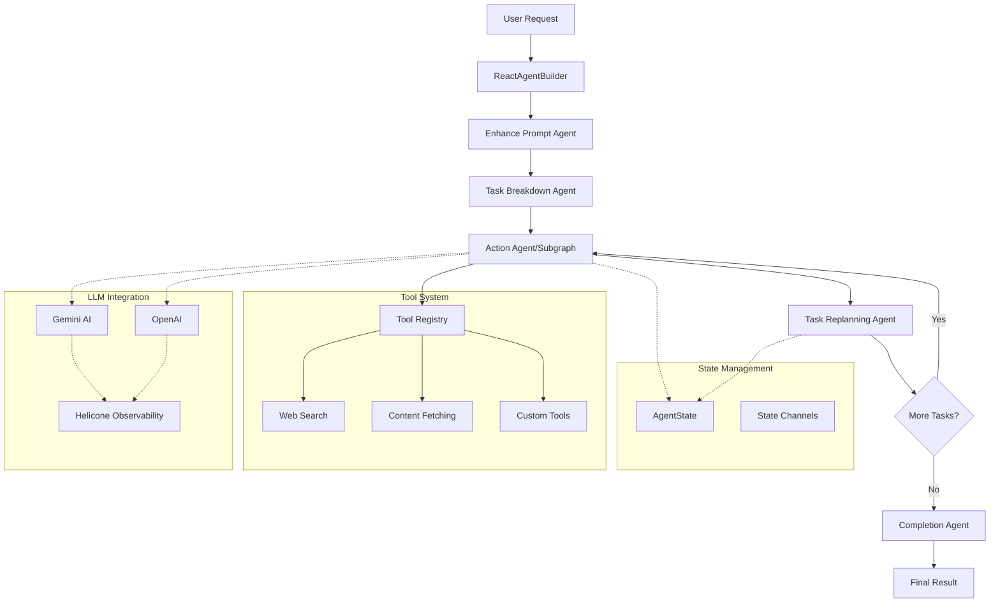

### AI Agent & Agentic

> tl;dr:
> 
> AI Agents: Task-specific, follow rules, act when triggered, limited learning.
> 
> Agentic AI: Highly autonomous, proactive, adapts, and handles complex, changing scenarios.

**AI Agent:**
An AI agent is a digital system that can perceive its environment, reason about information, and take actions to achieve specific goals—often with minimal human help. Think of it as a smart intern or digital worker: you give it a task, and it figures out the steps, uses tools, and gets the job done for you.

**Agentic Trait:**
Agentic AI describes systems with high autonomy and initiative. These agents can set their own goals, make independent decisions, learn and adapt to new situations, and proactively solve problems—not just react to instructions. Agentic AI is proactive, adaptive, and can coordinate multiple agents or tools for complex, dynamic tasks.

### Architecture/Approach

Most AI agents follow a loop of:
- **Perception:** Observes environment (inputs, tools, APIs)
- **Reasoning:** Analyzes data, plans steps, simulates logic
- **Action:** Executes steps using tools or APIs
- **Learning:** Improves over time from experience

Agentic AI extends this by integrating all these traits, enabling the agent to operate with greater independence, adaptability, and initiative—closely mimicking human problem-solving.

#### Single-Agent Architecture
> tl;dr: One LLM does all reasoning and acting, using tools and memory.

A single-agent system consists of one intelligent agent (often powered by an LLM) that is responsible for all perception, reasoning, planning, and action. The agent is equipped with a set of tools and a defined action space. It operates independently, making decisions and executing tasks in a sequential, unified workflow. Notable architectures are ReAct, RAISE, Reflexion, LATS.

**When to use:**
- Tasks are well-defined and can be handled by one agent
- Simpler to build, maintain, and debug
- Lower cost and resource requirements

**Example:**
*A customer support chatbot that answers user questions, fetches order status, and provides troubleshooting—all handled by a single LLM agent with access to company knowledge base and APIs.*

#### Multi-Agent Architecture
> tl;dr: Multiple agents collaborate, each with their own role and tools, to solve complex tasks.

Multi-agent systems involve two or more agents, each with specialized roles, tools, or expertise. Agents can communicate, collaborate, and divide complex tasks into subtasks. They may operate in parallel, provide feedback to each other, or coordinate to achieve shared goals. Notable architectures are DyLAN, Agentverse, MetaGPT

**When to use:**
- Tasks require diverse expertise, parallelism, or feedback between agents
- Problems are too complex or broad for a single agent
- Scalability, modularity, or long-term adaptability is needed

**Example:**
*An AI research assistant platform where one agent specializes in web search, another in summarizing documents, and a third in generating reports. These agents collaborate—searching, analyzing, and compiling results—to deliver a comprehensive research summary to the user.*

#### Key Considerations
- Single-agent systems are simpler and cost-effective for most use cases (80%+)
- Multi-agent systems are more complex but unlock powerful capabilities for specialized, long-running, or collaborative tasks

### What is ReAct Agent

**ReAct Agent**
The ReAct (Reason + Act) Agent is a single-agent architecture that tightly integrates reasoning and action in an iterative loop. Powered by a large language model (LLM), a ReAct agent cycles through three phases: Thought (reasoning about the task), Action (using tools or APIs), and Observation (reviewing results). This loop continues until the task is solved or a goal is reached.

**Why is ReAct sufficient for most use cases?**
- Most real-world automation and knowledge tasks can be handled by a single, well-instructed agent with access to the right tools.
- ReAct agents are simple to build, maintain, and scale, making them ideal for 80%+ of business and product needs.
- The architecture is flexible: you can add more tools, memory, or prompt strategies as needed, without the complexity of multi-agent coordination.
- ReAct agents excel at tasks that require step-by-step reasoning, tool use, and adaptability—such as research, content generation, workflow automation, and technical support.

### Why we need AI/ReAct Agent

**Benefits and Leverage of AI/ReAct Agents**

- **Autonomous Problem Solving:** ReAct agents can independently break down complex objectives, plan steps, and execute actions—reducing manual work and human oversight.
- **Tool Augmentation:** By integrating with APIs, databases, and business tools, agents can fetch data, perform calculations, and automate workflows end-to-end.
- **Adaptability:** The Thought-Action-Observation loop allows agents to adapt to new information, recover from errors, and refine their approach in real time.
- **Scalability:** Single-agent ReAct systems are easy to deploy and scale, making them suitable for startups, SaaS products, and enterprise automation.
- **Cost-Effective:** Lower development and maintenance costs compared to multi-agent or highly customized systems.
- **Human-Like Reasoning:** Mimics how people solve problems—thinking, acting, checking results, and iterating—leading to more robust and explainable AI behavior.
- **Foundation for Growth:** You can start with a single ReAct agent and later expand to multi-agent or hybrid systems as your needs grow.

## DelReAct Agent Architecture

### Overview

DelReact Agent is a robust, extensible framework for building intelligent AI agents that can autonomously plan, reason, and act to accomplish complex, multi-step tasks. 

DelReact is inspired by the ReAct Agent Architecture—a paradigm where a single agent, powered by a large language model (LLM), iteratively cycles through Thought, Action, and Observation.

Built on top of LangChain and LangGraph, DelReact provides:
- A pre-defined agent pipeline (ReactAgentBuilder) for orchestrating multi-step workflows
- Dynamic tool integration (including web search, content fetching, and custom business tools)
- Agent Memory and session observability
- Advanced error handling and dynamic replanning
- Support for multiple LLM providers (Gemini, OpenAI, OpenRouter)
- Extensible architecture for custom agents, tools, and workflows

### Architecture

The framework uses a 5-stage workflow:

1. **Enhance Prompt** (optional) - Improves user prompts for clarity and precision
2. **Task Breakdown** - Decomposes objectives into executable tasks
3. **Action Execution** - Processes individual tasks with available tools
4. **Task Replanning** - Dynamically adjusts remaining tasks based on progress
5. **Completion** - Synthesizes results into final output

### Why We Build This

> **tl;dr:** DelReact is built for real-world agentic systems, extensible, and ready for complex workflows out of the box.

DelReact was built to address the real-world needs of developers and organizations who want to move beyond simple, single-step LLM calls and build quickly an agentic systems. While the classic ReAct pattern is powerful, it lacks modularity, extensibility, and orchestration for complex workflows.

**Key motivations and foundational differences:**
- **Ready to Use Pipeline:** DelReact introduces a multi-stage, enhanced agent pipeline (prompt enhancement, task breakdown, action, replanning, completion) that can be used out of the box without further implementation/boilerplating.
- **Tool System & Registry:** Unlike basic ReAct, DelReact has a dynamic, registry-based tool system with support for custom tools, web search, content fetching, and external MCP servers.
- **Memory & Observability:** DelReact supports in-memory, PostgreSQL, and Redis backends for session and context tracking, enabling persistent, context-aware agents.
- **Multi-Provider LLM Support:** Easily switch between Gemini, OpenAI, and OpenRouter, with runtime configuration and observability.
- **Dynamic Replanning:** Built-in error handling and adaptive task replanning for fallback strategy
- **Extensibility:** Developers can inject custom agents, tools, and subgraphs, or compose multi-agent workflows as needs grow.

### What is Benefit and Leverage

> **tl;dr:** DelReact gives you a plug-and-play, pre-defined agentic framework—less boilerplate, more power, and easy scaling.

**Advantages of the DelReact Agent Framework:**

- **Boilerolate-Ready:** Ready to use AI Agents designed for reliability, error recovery, and quick deployment.
- **Composable Workflows:** Easily build, extend, and orchestrate complex agent pipelines and subgraphs.
- **Dynamic Tooling:** Register, discover, and manage tools at runtime—including external MCP tools—for maximum flexibility.
- **Memory & Session Support:** Track conversations, context, and state across sessions and workflows.
- **Multi-Provider Flexibility:** Seamlessly use and switch between multiple LLM providers.
- **Customizability:** Inject your own agents, tools, and logic without modifying the core framework.
- **Observability:** Built-in event emitters and session tracking for monitoring and debugging.
- **Scalable Foundation:** Start simple, scale to multi-agent or distributed workflows as your needs grow.