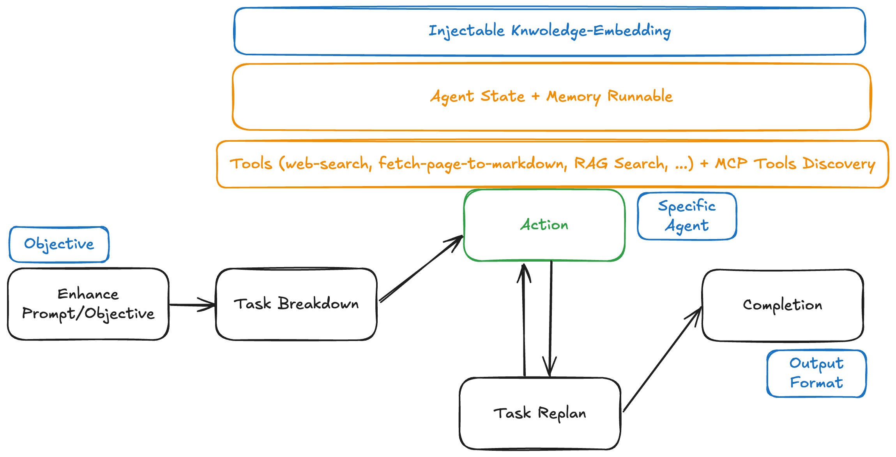

# Welcome to DelReact Agent

DelReact Agent is an extensible TS/JS framework for building intelligent AI agents that can autonomously plan, reason, and act to accomplish complex, multi-step tasks.

## What is DelReact?

DelReact is inspired by the ReAct Agent Architecture—a paradigm where a single agent, powered by a large language model (LLM), iteratively cycles through Thought, Action, and Observation.

Built on top of LangChain and LangGraph, DelReact provides:
- Fully autonomous AI agents ready to use out of the box
- A pre-defined agent pipeline (`ReactAgentBuilder`) for orchestrating complex, multi-step workflows
- Dynamic tool integration (including web search, content fetching, and custom business tools)
- Agent Memory and Session Observability
- Advanced error handling and dynamic replanning
- Support for multiple LLM providers (Gemini, OpenAI, OpenRouter)
- Extensible architecture for custom agents, tools, and workflows

## Quick Start

### Installation & Setup

```bash
# minimum nodejs version >= 18.0.0
# other minimum environment: npm >= 8.0.0, Typescript >= 4.7 (for TS projects), internet connection for LLM/tool APIs
npm i delreact-agent
# npm i dotenv
```

Set up environment variables:
```bash
# .env
GEMINI_KEY=your_gemini_api_key  # Pick One or Both
OPENAI_KEY=your_openai_api_key  # Pick One or Both
```

### Basic Usage

```typescript
import dotenv from "dotenv";
import { ReactAgentBuilder } from "delreact-agent";

dotenv.config();

const agent = new ReactAgentBuilder({
  openaiKey: process.env.OPENAI_KEY,  // example using openai
  useEnhancedPrompt: true
})
.init({
  selectedProvider: 'openai',
  model: 'gpt-4o-mini',
  maxTasks: 8,
})
.build();

const result = await agent.invoke({
  objective: "What is GDP of second winner on 2022 World Cup?",
  outputInstruction: "Present it in structured sections: Summary, GDP, Year, Country"
});

console.log(result.conclusion);
// Summary: The question asks for the GDP of the runner-up in the 2022 FIFA World Cup.\n\nGDP: $2.924 trillion\n\nYear: 2022\n\nCountry: France\n
```

### Architecture


